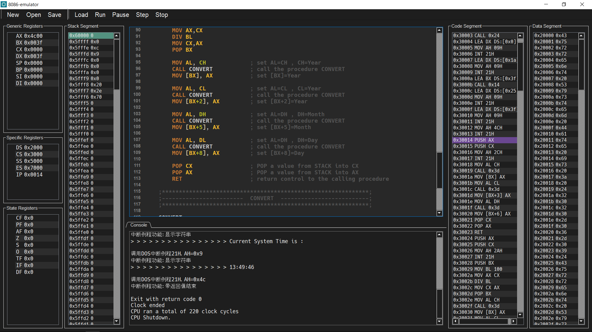
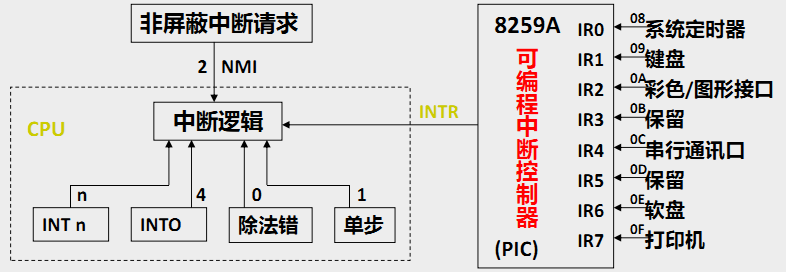
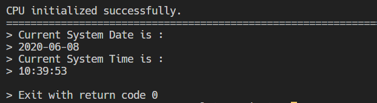
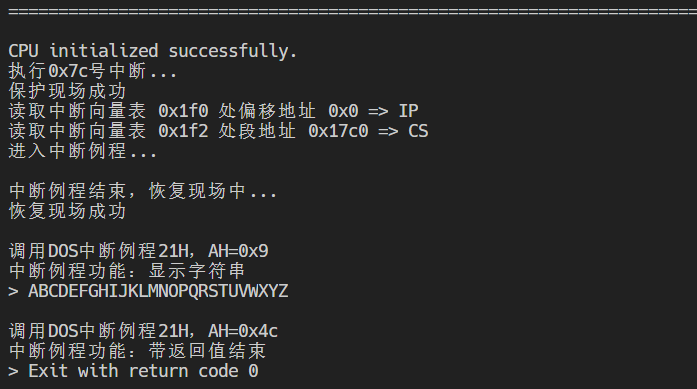
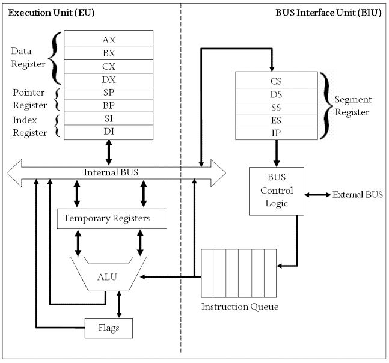
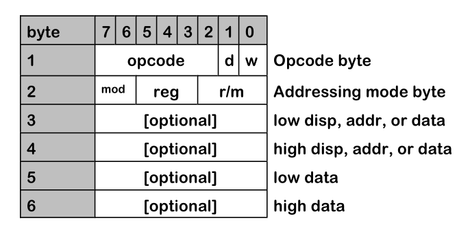
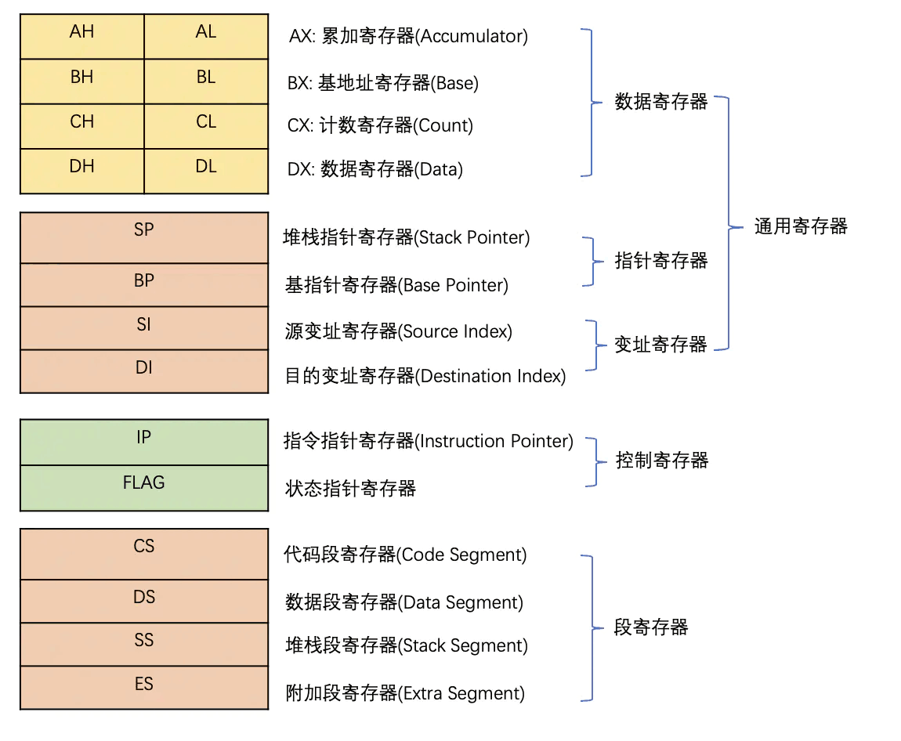
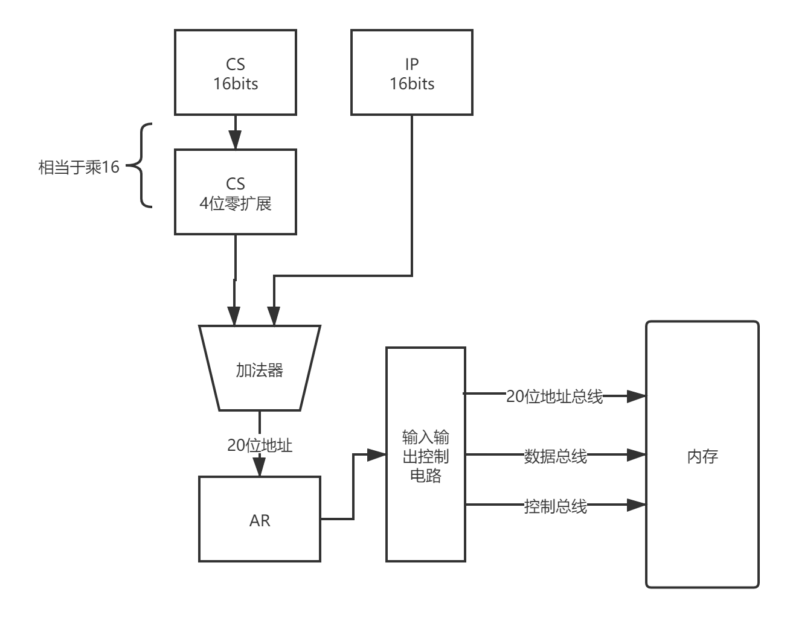
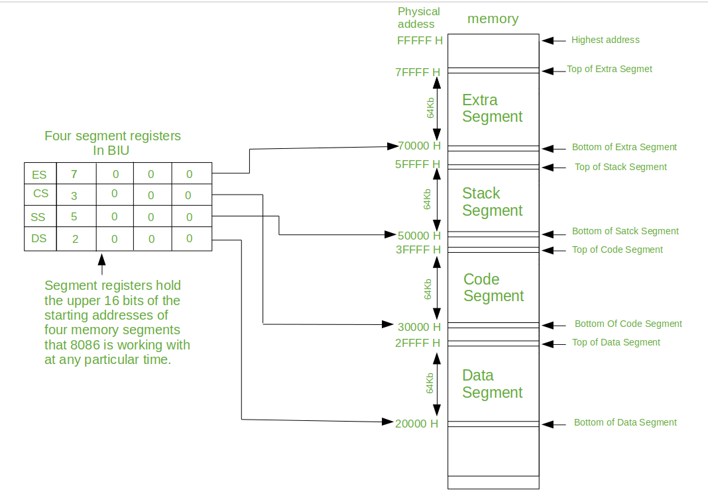

# 8086-emulator
   

Intel 8086仿真模拟器。

## v4.0更新内容
- 中断
- GUI优化
- 断点运行
- 多种打印模式
- DOS系统调用（获取系统时间、打印字符串等）

## Features
- 输入为8086汇编程序，支持几乎所有8086指令
- 伪指令包含MASM5.0核心指令，采用Small存储模型
- 支持中断、单步、暂停、断点、debug、交互式执行汇编
- 支持王爽《汇编语言》前11章所有程序
- 支持8086所有寄存器，包括高低字节
- 支持段寄存器、栈、指令队列等特性
- BIU和EU组成2级流水线
- 图形界面GUI、汇编代码高亮和编辑

## Usage
- 本模拟系统有两种运行模式：CLI命令行模式和GUI图形界面模式，其中CLI支持输入和debug。
- 运行输入为8086汇编代码，目前已经编写了近50条各种类型的汇编代码，在程序根目录`tests`文件夹中，也可以在网上查找汇编代码，稍加修改即可运行。

### GUI运行说明
- 支持代码编辑、运行、单步执行、暂停、停止等
- 双击程序根目录下`mainUI.exe`即可运行，也可以执行以下代码运行：
```shell
$ python mainUI.py
```
#### 界面说明


- 命令栏：
    - New：创建空白汇编文件
    - Open：打开汇编汇编
    - Save：将当前编辑的汇编文件保存
- 执行控制栏：
    - Load：加载当前程序到CPU，每次执行汇编前都需要Load
    - Run：顺序执行汇编代码，直到断点、中断或者结束
    - Pause：暂停执行，在Run的时候异步中断，再按Run或Step可以继续执行
    - Step：单步执行
    - Stop：终止执行，CPU停机
- 寄存器栏：最左边的寄存器栏，显示当前寄存器状态
- 段内存栏：
    - Stack Segment：显示栈空间内存，高亮SS：SP指针
    - Code Segment：显示代码段内存，高亮CS：IP指针
    - Data Segment：显示默认数据段内存
- 编辑器：可以直接修改代码运行、保存等
- Console：程序运行输出，暂不支持输入

#### 运行方法
1. 点击Load加载程序
2. 点击Run（连续）或者Step（单步）运行程序
3. 查看输出

其他操作示例：
- Run过程中可以点击Pause暂停，然后再Run或者Step
- Open打开`tests`文件夹中的汇编文件，再次Load后运行
- 修改汇编代码，Load后再运行
- 随时按Stop使得CPU停机


### CLI运行说明
命令行交互CLI比GUI多的功能：
- debug交互模式
- 支持输入

运行方法：在程序根目录命令行中执行：
```sh
$ python main.py ./tests/Requirement/bubble_sort.asm -n
```
#### 参数说明
第一个参数为需要执行的汇编程序（在`tests`文件夹）
后面有两个可选参数：
- `--nodebug`：可简写为`-n`，关闭debug，持续运行直到断点或结束。示例：
    ```shell
    $ python main.py ./tests/Interrupt/show_date_time.asm -n
    ```
- `--interrupt`：可简写为`-i`，显示中断信息。示例：
    ```shell
    $ python main.py ./tests/Interrupt/int3_test.asm -n -i
    ```

#### Debug模式
- 默认的debug模式，单步运行，每条指令执行结束打印cpu信息
- 在单步暂停时，可以使用模拟DOS调试工具[DEBUG](http://tinylab.org/assembly/fl/fl1.htm)，支持以下命令：

| 命令 | 功能                                 | 示例                                 |
|------|--------------------------------------|--------------------------------------|
| A    | 以交互式方式输入汇编指令并执行           |           a<br>mov al,0xd8           |
| D    | 以内存映象方式显示内存中的数据。     | D [地址] <br>D [起始地址] [目的地址] |
| R    | 显示所有寄存器内容，包括标志寄存器。 |                   r                  |


## 中断
模拟8086采用的8259A中断控制器。




### 内中断（同步）Software Interrupts
CPU内部产生的，不涉及外设的异常。我们提供的8086cpu主要内中断有上述虚线框中的4种，内中断不可屏蔽。

中断过程：
1. 取得中断类型码N
2. pushf
3. TF=0，IF=0
4. push CS
5. push IP
6. (IP)=(N * 4),(CS)=(N * 4+2)

中断返回iret：
1. pop IP
2. pop CS
3. popf

### 外中断（异步）Hardware Interrupts
外中断由外设通过芯片针脚发送的信号触发，有两类：
- NMI (Non Maskable Interrupt) – 不可屏蔽，上升沿有效，最高优先级中断，引发int 2中断。
- INTR (Interrupt Request) – 由I/O端口触发，可屏蔽，IF=1时响应，高电平有效，可以引发任意type中断. 


### 中断向量表 Interrupt Vector Table
- 中断类型码8位，对应256个中断源。
- 在8086PC机中，中断向量表指定放在内存地址0处。地址为`0000:0000`到`0000:03FF`，共1024个单元。
- 一个表项占用两个字节，高地址放段地址，低地址放偏移地址
- 为了简化，将处理程序从地址`1000：0000`开始放置，空间大小固定为`100h`。

| TYPE     | 功能                                            | 地址      |   实现                                             |
|----------|-------------------------------------------------|-----------|----------------------------------------------------|
| 0H       | Divide Error                                    | 1000:0000 |   div和idiv指令执行时检查，结果是否溢出或者除数为0 |
| 1H       | Single step execution for debugging of program. | 1000:0100 |  一条指令执行后检查TF标志                          |
| 2H       | Non-Maskable Interrupt (NMI)                    | 1000:0200 | GUI中”PAUSE“暂停即用NMI实现                        |
| 3H       | Break-point Interrupt                           | 1000:0300 |   执行int 3h或者int 时断点中断                     |
| 4H       | Overflow Interrupt                              | 1000:0400 |   OF=1时调用 INTO 将中断，判断有符号运算的溢出     |
| 5H-31H   |   系统备用中断                                  |           |                                                    |
| 10H      | BIOS INT 10H                                    |           |                                                    |
| 21H      | DOS INT 21H                                     |           |                                                    |
| 32H-0FFH |   用户定义中断                                  |           |                                                    |

### 中断例程 Interrupt Service Routine
- ISR：一个供程序员调用的中断例程常常包括多个子程序，中断例程内部根据传递进来的参数决定执行哪一个子程序。
- 中断处理程序功能：
    1. 保存用到的寄存器
    2. 处理中断
    3. 恢复用到的寄存器
    4. 用iret指令返回
- 中断例程模版：
```asm86=
入口地址:PUSH AX     ;保护现场
        PUSH BX
         :
        PUSH BP
        CLI         ;开中断
         :
         :          ;中断服务
         :
        STI         ;关中断
        POP BP      ;恢复现场
         :
        POP BX
        POP AX
        CLI         ;开中断
        IRET        ;中断返回
```
#### DOS中断例程 INT 21H
- MS-DOS API最初是86-DOS中的应用程序接口（API），并也被MS-DOS/PC-DOS及其他DOS兼容操作系统使用。大多数对DOS API的调用是使用中断21h（INT 21h）。在调用INT 21h时，在AH 寄存器中带有子函数号，其他寄存器中带有其他参数，从而调用各个DOS服务。DOS服务包括键盘输入、视频输入、磁盘文件访问、执行程序、内存分配及其他事务。
- 已模拟实现的功能如下：

| AH | 功能                | 调用参数                  | 返回参数                    |
|----|---------------------|---------------------------|-----------------------------|
| 00 | 程序终止(同INT 20H) | CS=程序段前缀             | 　                          |
| 01 | 键盘输入并回显      | 　                        | AL=输入字符                 |
| 02 | 显示输出            | DL=输出字符               | 　                          |
| 09 | 显示字符串          | DS:DX=串地址<br>'$'结束字符串 |                             |
| 2A | 取日期              | 　                        | CX=年 DH:DL=月:日    |
| 2C | 取时间              | 　                        | CH:CL=时:分<br> DH:DL=秒:1/100秒 |
| 35 | 取中断向量          | AL=中断类型               | ES:BX=中断向量              |
| 4C | 带返回码结束        | AL=返回码                 |                             |

调用DOS中断示例：
```shell
$ python main.py ./tests/Interrupt/show_date_time.asm -n
```
程序如下：
```asm86=
ASSUME CS:CODE,DS:DATA

DATA SEGMENT
PROMPT1    DB  'Current System Date is : $'
DATE       DB  '0000-00-00$'      ; date format year:month:day
PROMPT2    DB  'Current System Time is : $'     
TIME       DB  '00:00:00$'        ; time format hr:min:sec
DATA ENDS

CODE SEGMENT
    MAIN:
        MOV AX, DATA                ; initialize DS
        MOV DS, AX
        ;-------------Print DATE-------------------------
        LEA BX, DATE                 ; BX=offset address of string DATE
        CALL GET_DATE                ; call the procedure GET_DATE

        LEA DX, PROMPT1               ; DX=offset address of string PROMPT
        MOV AH, 09H                  ; print the string PROMPT
        INT 21H                      

        LEA DX, DATE                 ; DX=offset address of string TIME
        MOV AH, 09H                  ; print the string TIME
        INT 21H     
        ;-------------Print TIME-------------------------
        LEA BX, TIME                 ; BX=offset address of string TIME
        CALL GET_TIME                ; call the procedure GET_TIME

        LEA DX, PROMPT2               ; DX=offset address of string PROMPT
        MOV AH, 09H                  ; print the string PROMPT
        INT 21H                      

        LEA DX, TIME                 ; DX=offset address of string TIME
        MOV AH, 09H                  ; print the string TIME
        INT 21H                      

        MOV AH, 4CH                  ; return control to DOS
        INT 21H

    ;**************************************************************************;
    ;------------------------------  GET_TIME  --------------------------------;
    ;**************************************************************************;
    GET_TIME:
        ; this procedure will get the current system time 
        ; input : BX=offset address of the string TIME
        ; output : BX=current time
        PUSH AX                       ; PUSH AX onto the STACK
        PUSH CX                       ; PUSH CX onto the STACK 

        MOV AH, 2CH                   ; get the current system time
        INT 21H                       

        MOV AL, CH                    ; set AL=CH , CH=hours
        CALL CONVERT                  ; call the procedure CONVERT
        MOV [BX], AX                  ; set [BX]=hr  , [BX] is pointing to hr

        MOV AL, CL                    ; set AL=CL , CL=minutes
        CALL CONVERT                  ; call the procedure CONVERT
        MOV [BX+3], AX                ; set [BX+3]=min  , [BX] is pointing to min
                                                
        MOV AL, DH                    ; set AL=DH , DH=seconds
        CALL CONVERT                  ; call the procedure CONVERT
        MOV [BX+6], AX                ; set [BX+6]=min  , [BX] is pointing to sec
                                                            
        POP CX                        ; POP a value from STACK into CX
        POP AX                        ; POP a value from STACK into AX

        RET                           ; return control to the calling procedure

    ;**************************************************************************;
    ;------------------------------  GET_DATE  --------------------------------;
    ;**************************************************************************;
    GET_DATE:
    ; this procedure will get the current system time 
    ; input : BX=offset address of the string TIME
    ; output : BX=current time
        PUSH AX                       ; PUSH AX onto the STACK
        PUSH CX                       ; PUSH CX onto the STACK 

        MOV AH, 2AH                   ; get the current system Date
        INT 21H                       

        PUSH BX
        MOV BL,100
        MOV AX,CX
        DIV BL
        MOV CX,AX
        POP BX

        MOV AL, CH                    ; set AL=CH , CH=Year
        CALL CONVERT                  ; call the procedure CONVERT
        MOV [BX], AX                  ; set [BX]=Year  , [BX] is pointing to Year

        MOV AL, CL                    ; set AL=CL , CL=Year
        CALL CONVERT                  ; call the procedure CONVERT
        MOV [BX+2], AX                ; set [BX+2]=Year  , [BX] is pointing to Year
                                                
        MOV AL, DH                    ; set AL=DH , DH=Month
        CALL CONVERT                  ; call the procedure CONVERT
        MOV [BX+5], AX                ; set [BX+5]=Month  , [BX] is pointing to Year
                                                            
        MOV AL, DL                    ; set AL=DH , DH=Day
        CALL CONVERT                  ; call the procedure CONVERT
        MOV [BX+8], AX                ; set [BX+8]=Day  , [BX] is pointing to Year

        POP CX                        ; POP a value from STACK into CX
        POP AX                        ; POP a value from STACK into AX
        RET                           ; return control to the calling procedure
        
    ;**************************************************************************;
    ;-------------------------------  CONVERT  --------------------------------;
    ;**************************************************************************;

    CONVERT:
    ; this procedure will convert the given binary code into ASCII code
    ; input : AL=binary code
    ; output : AX=ASCII code
        PUSH DX                       ; PUSH DX onto the STACK 
        MOV AH, 0                     ; set AH=0
        MOV DL, 10                    ; set DL=10
        DIV DL                        ; set AX=AX/DL
        OR AX, 3030H                  ; convert the binary code in AX into ASCII
        POP DX                        ; POP a value from STACK into DX 
        RET                           ; return control to the calling procedure

CODE ENDS
END MAIN

```
运行结果如下：


该示例多次调用DOS中断服务，获取系统日期和时间并打印，如需查看中断信息，可在命令行添加`-i`选项。

#### BIOS中断例程 INT 10H
- INT 10H是显示服务(Video Service)
- 因基于BIOS测试不便，尚未实现

#### 用户中断例程
用户可以自行编写中断例程，安装方法有两种：
1. CPU预加载，需简单更改`isr.py`文件
2. 运行汇编程序安装，使用MOSB指令（参考《汇编语言》第3版 12.8节代码）

这里提供一个用户中断例程示例`isr7c.asm`，实现将字符串转换为大写，`ds:si`指向字符串首地址：
```asm86=
assume cs:code

code segment
    upper: 
        push cx
        push si
    change:
        mov cl,[si]
        mov ch,0
        jcxz ok
        and byte ptr [si],11011111b
        inc si
        jmp short change
    ok:
        pop si
        pop cx
        iret
code ends
end upper
```

测试代码如下：
```asm8086=
assume cs:code,ds:data

data segment
    msg db 'abcdefghijklmnopqrstuvwxyz$'
data ends

code segment
    start: mov ax,data
           mov ds,ax

           mov si,0           ;调用upper中断例程，转换为大写
           int 7ch
           
           mov dx,offset msg  ;lea dx,msg
           mov ah,9 
           int 21h            ; 调用BIOS中断例程，打印msg

           mov ax,4c00h
           int 21h
code ends
end start
```
运行测试方式：
```shell
$ python main.py ./tests/Interrupt/int7c_test.asm -n -i
```
运行结果：


可以看到本测试用例进行了3次中断调用：
1. 中断服务程序`isr7c.asm`将测试程序中的小写字母转换为大写
2. 中断服务程序`dos_isr_21h`的子程序`09h`打印该字符串
3. 中断服务程序`dos_isr_21h`的子程序`4ch`带返回值结束

### 中断优先级和嵌套
- 8086中软中断不能嵌套，硬中断可以嵌套。
- 本模拟程序中凡调用中断例程均允许嵌套


## 数据通路
x86构架的开端Intel 8086所有的内部寄存器、内部及外部数据总线都是16位宽，运算器、寄存器均为16位，是完全的16位微处理器，采用小端模式。20位外部地址总线，物理定址空间为1MB。


## 指令系统
- 使用最常见的Intel x86指令集。
- 汇编语言大小写不敏感，为了统一风格，我们采用大写。

### 操作数寻址方式 Addressing mode

| 名称             | 语法        | 有效地址EA         | 段地址SA   | 示例               |
|------------------|-------------|--------------------|------------|--------------------|
| 隐含寻址         | 无          | 操作数 在专用寄存器 | -          | STC                |
| 立即寻址         | Imm         | 操作数为Imm        | -          | MOV AX,36          |
| 寄存器寻址       | BX          | 操作数为(BX)       | -          | INC AX             |
| 直接/绝对寻址    | [Imm]       | Imm                | (DS)       | MOV [1234H],AX     |
| 寄存器间接寻址   | [BX]        | (BX)               | (DS)       | MOV [BX],BX        |
| 基址寻址         | [BX+Imm]    | (BX)+Imm           | (DS)       | MOV AL, [BX+200]   |
| 基址寻址         | [BP+Imm]    | (BP)+Imm           | (SS)       | MOV AX, [BP+10H]   |
| 变址寻址         | [SI+Imm]    | (SI)+Imm           | (DS)       | MOV AH, [SI+2000]  |
| 基址变址寻址     | [BP+SI]     | (BP)+(SI)          | (SS)或(DS) | MOV AX, [BX+DI]    |
| 相对基址变址寻址 | [BP+SI+Imm] | (BP)+(SI)+Imm      | (SS)或(DS) | MOV AX, [BX+DI+4H] |
| 字符串寻址       | MOVS B      |                    | MOVS B     | MOVS W             |
| 输入输出寻址     | IN A, 45    |                    | 输入输出   | OUT A, 50          |

> - 段偏移寻址：SA:EA = SA*16+EA
> - Base register: BX, BP
> - Index register: SI, DI 
> - 基址变址寻址格式：Base + Index
> - 8086CPU中，只有bx，si，di，bp这4个寄存器可以用于"[...]"中
> - 含有BP则默认段寄存器为SS，其他情况为DS
> - 支持超越前缀：显示的给出段地址


### 数字格式

|格式    | 示例      |   解释    |
|:-------:|:-----------:|:----------:|
|二进制  | 0111b     |值7          |
|十进制  |  -87<br>-87d   | 值-87，没有后缀时默认为十进制 |
|十六进制|  0A3h<br>0x0A3     | 值163，开头为字母时，前面必须加0|

### 指令格式 

根据操作数的个数，可以分为以下3种：
- 无操作数指令
    | OP  |
    | --- |
- 单操作数指令
    | OP  |    D1   | 
    | --- |   ---   |
- 双操作数指令
    | OP  |    D1   |     D2    |
    | --- |   ---   |    ---    |
Intel X86指令属于复杂计算机指令集(CISC)，具有如下特点：
- 变长指令：单条指令的长度不固定，常用的指令设计成较短指令，不常用的指令设计成较长指令。
- 指令编码非常紧凑：经常使用隐式操作数，使操作数不直接出现在二进制指令中。这样节省指令长度。
- 丰富的操作数寻址方式

8086CPU指令系统，它采用1~6个指令字节的变字长，包括操作码(第一字节)、寻址方式(第二字节)和操作数(第三到第六字节)三部分组成，指令格式如下：



#### 第一字节(BYTE 1)
- 指令定义了处理器要执行的操作。操作码通常位于第一字节，某些指令的操作码会扩展到第二字节（即ModR/M字节）的REG域，故有时候REG域也被称为REG/Opcode域，用来指出该域的两种用途。
- 绝大多数的指令的第一字节的高6个比特位(即BYTE1[7:2])是操作码，BYTE1[1]是D标志位，指明操作的方向，BYTE1[0]是W标志位，指示操作数的宽度。
     | 标志位 | 值 | 含义 |
     | -------- | -------- | -------- |
     | D     | 0     | ModR/M字节的REG域是源操作数     |
     | D     | 1     | ModR/M字节的REG域是目标操作数     |
     | W     | 0     | 指示指令是字节操作     |
     | W     | 1     | 指示指令是字操作字字     |

#### 第二字节(BYTE 2)
- 第二字节是ModR/M字节，基本用途是指示指令的两个操作数，以及该字节之后是否还有其他字节（位移量字节和立即数字节）。由于主要用于用于操作数寻址，所以又称为“寻址字节”。
- Mod域(BYTE2[7:6])有2个比特位，用于指示操作数的来源。

  | Mod编码(二进制)| 释义 |
  | -------- | -------- | -------- |
  | 00     | 存储器模式，无位移量字节；如果R/M=110，则有一个16位的位移量     |
  | 01     | 存储器模式，8位位移量字节（1个字节）     |
  | 10     | 存储器模式，16位位移量字节(2个字节)存储器模式，16位位移量字节(2个字节)     |
  | 11     | 寄存器模式（无位移量）     |

- REG域(BYTE2[5:3]，即寄存器域)用来指示一个寄存器，可以是源操作数，也可以是目的操作数，由第一字节的D标志位指示。具体编码格式如下：

    | REG | W=0 | W=1 |
    |-----|-----|-----|
    | 000 | AL  | AX  |
    | 001 | CL  | CX  |
    | 010 | DL  | DX  |
    | 011 | BL  | BX  |
    | 100 | AH  | SP  |
    | 101 | CH  | BP  |
    | 110 | DH  | SI  |
    | 111 | BH  | DI  |

- R/M域（BYTE2[2:0]，即寄存器/存储器域），用来指示另一个操作数，可以在存储器中，也可以在寄存器中。R/M域编码含义依赖于MOD域的设定。如果MOD=11（寄存器到寄存器模式），则R/M域标识第二个寄存器操作数。如果MOD是存储器模式（即00，01，10），则R/M指示如何如何计算存储器操作数的有效地址。

### 8086指令集编码
根据8086指令格式的形式，我们通过一个[编码矩阵](http://www.mlsite.net/8086/)的形式来集中体现操作码（第一字节码）的对应编码。后续的第二~六字节因为涉及到不同的寻址方式、寄存器/存储器的选取以及立即数的值，这些都会导致每一条指令编码的不同，所以在设计指令格式时我们并未对后面字节进行详细编码，而是用抽象形式来体现后续字节。

#### Opcode Map (Part 1)
<table class="tg">
  <tr>
    <th class="tg-d5a7"></th>
    <th class="tg-p8s6">0</th>
    <th class="tg-p8s6">1</th>
    <th class="tg-p8s6">2</th>
    <th class="tg-p8s6">3</th>
    <th class="tg-p8s6">4</th>
    <th class="tg-p8s6">5</th>
    <th class="tg-p8s6">6</th>
    <th class="tg-p8s6">7</th>
  </tr>
  <tr>
    <td class="tg-o1j9">0</td>
    <td class="tg-8qro">ADD<br>Eb Gb</td>
    <td class="tg-b786">ADD<br>Ev Gv</td>
    <td class="tg-8qro">ADD<br>Gb Eb</td>
    <td class="tg-b786">ADD<br>Gv Ev</td>
    <td class="tg-8qro">ADD<br>AL Ib</td>
    <td class="tg-b786">ADD<br>AX Iv</td>
    <td class="tg-8qro">PUSH<br>ES</td>
    <td class="tg-b786">POP<br>ES</td>
  </tr>
  <tr>
    <td class="tg-o1j9">1</td>
    <td class="tg-8qro">ADC<br>Eb Gb</td>
    <td class="tg-b786">ADC<br>Ev Gv</td>
    <td class="tg-8qro">ADC<br>Gb Eb</td>
    <td class="tg-b786">ADC<br>Gv Ev</td>
    <td class="tg-8qro">ADC<br>AL Ib</td>
    <td class="tg-b786">ADC<br>AX Iv</td>
    <td class="tg-8qro">PUSH<br>SS</td>
    <td class="tg-b786">POP<br>SS</td>
  </tr>
  <tr>
    <td class="tg-o1j9">2</td>
    <td class="tg-8qro">AND<br>Eb Gb</td>
    <td class="tg-b786">AND<br>Ev Gv</td>
    <td class="tg-8qro">AND<br>Gb Eb</td>
    <td class="tg-b786">AND<br>Gv Ev</td>
    <td class="tg-8qro">AND<br>AL Ib</td>
    <td class="tg-b786">AND<br>AX Iv</td>
    <td class="tg-8qro">ES:</td>
    <td class="tg-b786">DAA</td>
  </tr>
  <tr>
    <td class="tg-o1j9">3</td>
    <td class="tg-8qro">XOR<br>Eb Gb</td>
    <td class="tg-b786">XOR<br>Ev Gv</td>
    <td class="tg-8qro">XOR<br>Gb Eb</td>
    <td class="tg-b786">XOR<br>Gv Ev</td>
    <td class="tg-8qro">XOR<br>AL Ib</td>
    <td class="tg-b786">XOR<br>AX Iv</td>
    <td class="tg-8qro">SS:</td>
    <td class="tg-b786">AAA</td>
  </tr>
  <tr>
    <td class="tg-o1j9">4</td>
    <td class="tg-8qro">INC<br>AX</td>
    <td class="tg-b786">INC<br>CX</td>
    <td class="tg-8qro">INC<br>DX</td>
    <td class="tg-b786">INC<br>BX</td>
    <td class="tg-8qro">INC<br>SP</td>
    <td class="tg-b786">INC<br>BP</td>
    <td class="tg-8qro">INC<br>SI</td>
    <td class="tg-b786">INC<br>DI</td>
  </tr>
  <tr>
    <td class="tg-o1j9">5</td>
    <td class="tg-8qro">PUSH<br>AX</td>
    <td class="tg-b786">PUSH<br>CX</td>
    <td class="tg-8qro">PUSH<br>DX</td>
    <td class="tg-b786">PUSH<br>BX</td>
    <td class="tg-8qro">PUSH<br>SP</td>
    <td class="tg-b786">PUSH<br>BP</td>
    <td class="tg-8qro">PUSH<br>SI</td>
    <td class="tg-b786">PUSH<br>DI</td>
  </tr>
  <tr>
    <td class="tg-o1j9">6</td>
    <td class="tg-9d52"></td>
    <td class="tg-o6ju"></td>
    <td class="tg-9d52"></td>
    <td class="tg-o6ju"></td>
    <td class="tg-9d52"></td>
    <td class="tg-o6ju"></td>
    <td class="tg-9d52"></td>
    <td class="tg-o6ju"></td>
  </tr>
  <tr>
    <td class="tg-o1j9">7</td>
    <td class="tg-8qro">JO<br>Jb</td>
    <td class="tg-b786">JNO<br>Jb</td>
    <td class="tg-8qro">JB<br>Jb</td>
    <td class="tg-b786">JNB<br>Jb</td>
    <td class="tg-8qro">JZ<br>Jb</td>
    <td class="tg-b786">JNZ<br>Jb</td>
    <td class="tg-8qro">JBE<br>Jb</td>
    <td class="tg-b786">JA<br>Jb</td>
  </tr>
  <tr>
    <td class="tg-o1j9">8</td>
    <td class="tg-l9cj">GRP1<br>Eb Ib</td>
    <td class="tg-spmh">GRP1<br>Ev Iv</td>
    <td class="tg-l9cj">GRP1<br>Eb Ib</td>
    <td class="tg-spmh">GRP1<br>Ev Ib</td>
    <td class="tg-8qro">TEST<br>Gb Eb</td>
    <td class="tg-b786">TEST<br>Gv Ev</td>
    <td class="tg-8qro">XCHG<br>Gb Eb</td>
    <td class="tg-b786">XCHG<br>Gv Ev</td>
  </tr>
  <tr>
    <td class="tg-o1j9">9</td>
    <td class="tg-8qro">NOP</td>
    <td class="tg-b786">XCHG<br>CX AX</td>
    <td class="tg-8qro">XCHG<br>DX AX</td>
    <td class="tg-b786">XCHG<br>BX AX</td>
    <td class="tg-8qro">XCHG<br>SP AX</td>
    <td class="tg-b786">XCHG<br>BP AX</td>
    <td class="tg-8qro">XCHG<br>SI AX</td>
    <td class="tg-b786">XCHG<br>DI AX</td>
  </tr>
  <tr>
    <td class="tg-o1j9">A</td>
    <td class="tg-8qro">MOV<br>AL Ob</td>
    <td class="tg-b786">MOV<br>AX Ov</td>
    <td class="tg-8qro">MOV<br>Ob AL</td>
    <td class="tg-b786">MOV<br>Ov AX</td>
    <td class="tg-8qro">MOV<br>SB</td>
    <td class="tg-b786">MOV<br>SW</td>
    <td class="tg-8qro">CMP<br>SB</td>
    <td class="tg-b786">CMP<br>SW</td>
  </tr>
  <tr>
    <td class="tg-o1j9">B</td>
    <td class="tg-8qro">MOV<br>AL Ib</td>
    <td class="tg-b786">MOV<br>CL Ib</td>
    <td class="tg-8qro">MOV<br>DL Ib</td>
    <td class="tg-b786">MOV<br>BL Ib</td>
    <td class="tg-8qro">MOV<br>AH Ib</td>
    <td class="tg-b786">MOV<br>CH Ib</td>
    <td class="tg-8qro">MOV<br>DH Ib</td>
    <td class="tg-b786">MOV<br>BH Ib</td>
  </tr>
  <tr>
    <td class="tg-o1j9">C</td>
    <td class="tg-9d52"></td>
    <td class="tg-o6ju"></td>
    <td class="tg-8qro">RET<br>Iw</td>
    <td class="tg-b786">RET</td>
    <td class="tg-8qro">LES<br>Gv Mp</td>
    <td class="tg-b786">LDS<br>Gv Mp</td>
    <td class="tg-8qro">MOV<br>Eb Ib</td>
    <td class="tg-b786">MOV<br>Ev Iv</td>
  </tr>
  <tr>
    <td class="tg-o1j9">D</td>
    <td class="tg-l9cj">GRP2<br>Eb 1</td>
    <td class="tg-spmh">GRP2<br>Ev 1</td>
    <td class="tg-l9cj">GRP2<br>Eb CL</td>
    <td class="tg-spmh">GRP2<br>Ev CL</td>
    <td class="tg-8qro">AAM<br>I0</td>
    <td class="tg-b786">AAD<br>I0</td>
    <td class="tg-9d52"></td>
    <td class="tg-b786">XLAT</td>
  </tr>
  <tr>
    <td class="tg-o1j9">E</td>
    <td class="tg-8qro">LOOPNZ<br>Jb</td>
    <td class="tg-b786">LOOPZ<br>Jb</td>
    <td class="tg-8qro">LOOP<br>Jb</td>
    <td class="tg-b786">JCXZ<br>Jb</td>
    <td class="tg-8qro">IN<br>AL Ib</td>
    <td class="tg-b786">IN<br>AX Ib</td>
    <td class="tg-8qro">OUT<br>Ib AL</td>
    <td class="tg-b786">OUT<br>Ib AX</td>
  </tr>
  <tr>
    <td class="tg-o1j9">F</td>
    <td class="tg-8qro">LOCK</td>
    <td class="tg-o6ju"></td>
    <td class="tg-8qro">REPNZ</td>
    <td class="tg-b786">REPZ</td>
    <td class="tg-8qro">HLT</td>
    <td class="tg-b786">CMC</td>
    <td class="tg-l9cj">GRP3a<br>Eb</td>
    <td class="tg-spmh">GRP3b<br>Ev</td>
  </tr>
</table>

#### Opcode Map (Part 2)
<table class="tg">
  <tr>
    <th class="tg-xqy4"></th>
    <th class="tg-o1j9">8</th>
    <th class="tg-o1j9">9</th>
    <th class="tg-o1j9">A</th>
    <th class="tg-o1j9">B</th>
    <th class="tg-o1j9">C</th>
    <th class="tg-o1j9">D</th>
    <th class="tg-o1j9">E</th>
    <th class="tg-p8s6">F</th>
  </tr>
  <tr>
    <td class="tg-2em6">0</td>
    <td class="tg-8qro">OR<br>Eb Gb</td>
    <td class="tg-b786">OR<br>Ev Gv</td>
    <td class="tg-8qro">OR<br>Gb Eb</td>
    <td class="tg-b786">OR<br>Gv Ev</td>
    <td class="tg-8qro">OR<br>AL Ib</td>
    <td class="tg-b786">OR<br>AX Iv</td>
    <td class="tg-8qro">PUSH<br>CS</td>
    <td class="tg-o6ju"></td>
  </tr>
  <tr>
    <td class="tg-2em6">1</td>
    <td class="tg-8qro">SBB<br>Eb Gb</td>
    <td class="tg-b786">SBB<br>Ev Gv</td>
    <td class="tg-8qro">SBB<br>Gb Eb</td>
    <td class="tg-b786">SBB<br>Gv Ev</td>
    <td class="tg-8qro">SBB<br>AL Ib</td>
    <td class="tg-b786">SBB<br>AX Iv</td>
    <td class="tg-8qro">PUSH<br>DS</td>
    <td class="tg-b786">POP<br>DS</td>
  </tr>
  <tr>
    <td class="tg-2em6">2</td>
    <td class="tg-8qro">SUB<br>Eb Gb</td>
    <td class="tg-b786">SUB<br>Ev Gv</td>
    <td class="tg-8qro">SUB<br>Gb Eb</td>
    <td class="tg-b786">SUB<br>Gv Ev</td>
    <td class="tg-8qro">SUB<br>AL Ib</td>
    <td class="tg-b786">SUB<br>AX Iv</td>
    <td class="tg-8qro">CS:</td>
    <td class="tg-b786">DAS</td>
  </tr>
  <tr>
    <td class="tg-2em6">3</td>
    <td class="tg-8qro">CMP<br>Eb Gb</td>
    <td class="tg-b786">CMP<br>Ev Gv</td>
    <td class="tg-8qro">CMP<br>Gb Eb</td>
    <td class="tg-b786">CMP<br>Gv Ev</td>
    <td class="tg-8qro">CMP<br>AL Ib</td>
    <td class="tg-b786">CMP<br>AX Iv</td>
    <td class="tg-8qro">DS:</td>
    <td class="tg-b786">AAS</td>
  </tr>
  <tr>
    <td class="tg-2em6">4</td>
    <td class="tg-8qro">DEC<br>AX</td>
    <td class="tg-b786">DEC<br>CX</td>
    <td class="tg-8qro">DEC<br>DX</td>
    <td class="tg-b786">DEC<br>BX</td>
    <td class="tg-8qro">DEC<br>SP</td>
    <td class="tg-b786">DEC<br>BP</td>
    <td class="tg-8qro">DEC<br>SI</td>
    <td class="tg-b786">DEC<br>DI</td>
  </tr>
  <tr>
    <td class="tg-2em6">5</td>
    <td class="tg-8qro">POP<br>AX</td>
    <td class="tg-b786">POP<br>CX</td>
    <td class="tg-8qro">POP<br>DX</td>
    <td class="tg-b786">POP<br>BX</td>
    <td class="tg-8qro">POP<br>SP</td>
    <td class="tg-b786">POP<br>BP</td>
    <td class="tg-8qro">POP<br>SI</td>
    <td class="tg-b786">POP<br>DI</td>
  </tr>
  <tr>
    <td class="tg-2em6">6</td>
    <td class="tg-9d52"></td>
    <td class="tg-o6ju"></td>
    <td class="tg-9d52"></td>
    <td class="tg-o6ju"></td>
    <td class="tg-9d52"></td>
    <td class="tg-o6ju"></td>
    <td class="tg-9d52"></td>
    <td class="tg-o6ju"></td>
  </tr>
  <tr>
    <td class="tg-2em6">7</td>
    <td class="tg-8qro">JS<br>Jb</td>
    <td class="tg-b786">JNS<br>Jb</td>
    <td class="tg-8qro">JPE<br>Jb</td>
    <td class="tg-b786">JPO<br>Jb</td>
    <td class="tg-8qro">JL<br>Jb</td>
    <td class="tg-b786">JGE<br>Jb</td>
    <td class="tg-8qro">JLE<br>Jb</td>
    <td class="tg-b786">JG<br>Jb</td>
  </tr>
  <tr>
    <td class="tg-2em6">8</td>
    <td class="tg-8qro">MOV<br>Eb Gb</td>
    <td class="tg-b786">MOV<br>Ev Gv</td>
    <td class="tg-8qro">MOV<br>Gb Eb</td>
    <td class="tg-b786">MOV<br>Gv Ev</td>
    <td class="tg-8qro">MOV<br>Ew Sw</td>
    <td class="tg-b786">LEA<br>Gv M</td>
    <td class="tg-8qro">MOV<br>Sw Ew</td>
    <td class="tg-b786">POP<br>Ev</td>
  </tr>
  <tr>
    <td class="tg-2em6">9</td>
    <td class="tg-8qro">CBW</td>
    <td class="tg-b786">CWD</td>
    <td class="tg-8qro">CALL<br>Ap</td>
    <td class="tg-b786">WAIT</td>
    <td class="tg-8qro">PUSHF</td>
    <td class="tg-b786">POPF</td>
    <td class="tg-8qro">SAHF</td>
    <td class="tg-b786">LAHF</td>
  </tr>
  <tr>
    <td class="tg-2em6">A</td>
    <td class="tg-8qro">TEST<br>AL Ib</td>
    <td class="tg-b786">TEST<br>AX Iv</td>
    <td class="tg-8qro">STOSB</td>
    <td class="tg-b786">STOSW</td>
    <td class="tg-8qro">LODSB</td>
    <td class="tg-b786">LODSW</td>
    <td class="tg-8qro">SCASB</td>
    <td class="tg-b786">SCASW</td>
  </tr>
  <tr>
    <td class="tg-2em6">B</td>
    <td class="tg-8qro">MOV<br>AX Iv</td>
    <td class="tg-b786">MOV<br>CX Iv</td>
    <td class="tg-8qro">MOV<br>DX Iv</td>
    <td class="tg-b786">MOV<br>BX Iv</td>
    <td class="tg-8qro">MOV<br>SP Iv</td>
    <td class="tg-b786">MOV<br>BP Iv</td>
    <td class="tg-8qro">MOV<br>SI Iv</td>
    <td class="tg-b786">MOV<br>DI Iv</td>
  </tr>
  <tr>
    <td class="tg-2em6">C</td>
    <td class="tg-9d52"></td>
    <td class="tg-o6ju"></td>
    <td class="tg-8qro">RETF<br>Iw</td>
    <td class="tg-b786">RETF</td>
    <td class="tg-8qro">INT<br>3</td>
    <td class="tg-b786">INT<br>Ib</td>
    <td class="tg-8qro">INTO</td>
    <td class="tg-b786">IRET</td>
  </tr>
  <tr>
    <td class="tg-2em6">D</td>
    <td class="tg-9d52"></td>
    <td class="tg-o6ju"></td>
    <td class="tg-9d52"></td>
    <td class="tg-o6ju"></td>
    <td class="tg-9d52"></td>
    <td class="tg-o6ju"></td>
    <td class="tg-9d52"></td>
    <td class="tg-o6ju"></td>
  </tr>
  <tr>
    <td class="tg-2em6">E</td>
    <td class="tg-8qro">CALL<br>Jv</td>
    <td class="tg-b786">JMP<br>Jv</td>
    <td class="tg-8qro">JMP<br>Ap</td>
    <td class="tg-b786">JMP<br>Jb</td>
    <td class="tg-8qro">IN<br>AL DX</td>
    <td class="tg-b786">IN<br>AX DX</td>
    <td class="tg-8qro">OUT<br>DX AL</td>
    <td class="tg-b786">OUT<br>DX AX</td>
  </tr>
  <tr>
    <td class="tg-2em6">F</td>
    <td class="tg-8qro">CLC</td>
    <td class="tg-b786">STC</td>
    <td class="tg-8qro">CLI</td>
    <td class="tg-b786">STI</td>
    <td class="tg-8qro">CLD</td>
    <td class="tg-b786">STD</td>
    <td class="tg-l9cj">GRP4<br>Eb</td>
    <td class="tg-spmh">GRP5<br>Ev</td>
  </tr>
</table>

*注释：
(1)表格的列代表Opcode Byte的前4位，即Hi；行代表Opcode Byte的后4位，即Lo。
(2)在单元中每一个指令名称的下方都标有该指令所对应的寄存器和相应字长，部分指令还标有寻址方式。具体的寄存器的分类介绍请详见文档寄存器部分*

#### Opcode Map (Opcode Extensions)
<table class="tg">
  <tr>
    <th class="tg-xqy4">0</th>
    <th class="tg-o1j9">1</th>
    <th class="tg-o1j9">2</th>
    <th class="tg-o1j9">3</th>
    <th class="tg-o1j9">4</th>
    <th class="tg-o1j9">5</th>
    <th class="tg-o1j9">6</th>
    <th class="tg-o1j9">7</th>
    <th class="tg-p8s6">F</th>
  </tr>
  <tr>
    <td class="tg-2em6">GRP1</td>
    <td class="tg-8qro">ADD</td>
    <td class="tg-b786">OR</td>
    <td class="tg-8qro">ADC</td>
    <td class="tg-b786">SBB</td>
    <td class="tg-8qro">AND</td>
    <td class="tg-b786">SUB</td>
    <td class="tg-8qro">XOR</td>
    <td class="tg-b786">CMP</td>
  </tr>
  <tr>
    <td class="tg-2em6">GRP2</td>
    <td class="tg-8qro">ROL</td>
    <td class="tg-b786">ROR</td>
    <td class="tg-8qro">RCL</td>
    <td class="tg-b786">RCR</td>
    <td class="tg-8qro">SHL</td>
    <td class="tg-b786">SHR</td>
    <td class="tg-9d52"></td>
    <td class="tg-b786">SAR</td>
  </tr>
  <tr>
    <td class="tg-2em6">GRP3a</td>
    <td class="tg-8qro">TEST<br>Eb Ib</td>
    <td class="tg-o6ju"></td>
    <td class="tg-8qro">NOT</td>
    <td class="tg-b786">NEG</td>
    <td class="tg-8qro">MUL</td>
    <td class="tg-b786">IMUL</td>
    <td class="tg-8qro">DIV</td>
    <td class="tg-b786">IDIV</td>
  </tr>
  <tr>
    <td class="tg-2em6">GRP3b</td>
    <td class="tg-8qro">TEST<br>Ev Iv</td>
    <td class="tg-o6ju"></td>
    <td class="tg-8qro">NOT</td>
    <td class="tg-b786">NEG</td>
    <td class="tg-8qro">MUL</td>
    <td class="tg-b786">IMUL</td>
    <td class="tg-8qro">DIV</td>
    <td class="tg-b786">IDIV</td>
  </tr>
  <tr>
    <td class="tg-2em6">GRP4</td>
    <td class="tg-8qro">INC</td>
    <td class="tg-b786">DEC</td>
    <td class="tg-9d52"></td>
    <td class="tg-o6ju"></td>
    <td class="tg-9d52"></td>
    <td class="tg-o6ju"></td>
    <td class="tg-9d52"></td>
    <td class="tg-o6ju"></td>
  </tr>
  <tr>
    <td class="tg-2em6">GRP5</td>
    <td class="tg-8qro">INC</td>
    <td class="tg-b786">DEC</td>
    <td class="tg-8qro">CALL</td>
    <td class="tg-b786">CALL<br>Mp</td>
    <td class="tg-8qro">JMP</td>
    <td class="tg-b786">JMP<br>Mp</td>
    <td class="tg-8qro">PUSH</td>
    <td class="tg-o6ju"></td>
  </tr>
</table>

*注释：
(1)该表格对应上述编码矩阵中Opcode Byte相同的指令集，在该表格中详细展开区分。
(2)对于整体的编码矩阵，单元中的Addressing Code的说明如下表所示：*

| |Addressing Code 详细说明|
|---|---------------------------------------------------------------------------------------------------------------------------------------------------------------------------------------------------------------------------------------------------------------------------------------------------|
| A | Direct address. The instruction has no ModR/M byte; the address of the operand is encoded in the instruction. Applicable, e.g., to far JMP (opcode EA).                                                                                                                                           |
| E | A ModR/M byte follows the opcode and specifies the operand. The operand is either a general-purpose register or a memory address. If it is a memory address, the address is computed from a segment register and any of the following values: a base register, an index register, a displacement. |
| G | The reg field of the ModR/M byte selects a general register.                                                                                                                                                                                                                                      |
| I | Immediate data. The operand value is encoded in subsequent bytes of the instruction.                                                                                                                                                                                                              |
| J | The instruction contains a relative offset to be added to the address of the subsequent instruction. Applicable, e.g., to short JMP (opcode EB), or LOOP.                                                                                                                                         |
| M | The ModR/M byte may refer only to memory. Applicable, e.g., to LES and LDS.                                                                                                                                                                                                                       |
| O | The instruction has no ModR/M byte; the offset of the operand is encoded as a WORD in the instruction. Applicable, e.g., to certain MOVs (opcodes A0 through A3).                                                                                                                                 |
| S | The reg field of the ModR/M byte selects a segment register.                                                                                                                                                                                                                                      |
    
### 指令集
#### DATA TRANSFER INSTRUCTIONS

| 指令 | 格式 | 示例 | 操作 |
|-|-|-|-|
| MOV | MOV DST,SRC | mov ax,12 | 将立即数12送入寄存器AX |
| - | - | mov ax,bx | 将寄存器BX中的值送入寄存器AX |
| - | - | mov ax,[bx] | 将寄存器BX所指向的存储单元的值送入寄存器AX |
| XCHG | XCHG DST,SRC | xchg ax,bx | 互换寄存器AX中的值与寄存器BX中的值 |
| - | - | xchg ax,[bx] | 互换寄存器AX中的值与寄存器BX指向的存储单元的值 |
| LEA | LEA REG,MEM | lea ax,[bx] | 取BX指向的地址送到AX中 |
| LDS | LDS REG,MEM | lds ax,[bx] | 是把BX指向的地址,高位段值部分存放在数据段寄存器DS中，低位偏移部分存放在寄存器AX中 |
| LES | LES REG,MEM | les ax,[bx] | 是把BX指向的地址,高位段值部分存放在附加段寄存器ES中，低位偏移部分存放在寄存器AX中 |

#### ARITHMETIC INSTRUCTIONS

| 指令 | 格式 | 示例 | 操作 |
|-|-|-|-|
| ADD | ADD DST,SRC | add ax,-78 | 将AX寄存器的值加-78 |
| - | - | add bx,cx  | 将BX寄存器的值加上CX寄存器的值，存放在BX中。 |
| ADC | ADC DST,SRC | add ax,-78 | 将AX寄存器的值加-78，若进位符号CF为1，则AX再加1 |
| SUB | SUB DST,SRC | sub ax,30 | 将AX寄存器的值减去内存地址30处的值 |
| SBB | SBB DST,SRC | sbb ax,30 | 将AX寄存器的值减去内存地址30处的值，若进位符号CF为1，则AX再减1 |
| MUL | MUL SRC | mul bl | 无符号数乘法，寄存器AL中的值乘寄存器BL中的值，结果存入AX |
|-|-| mul bx | 无符号数乘法，寄存器AX中的值乘寄存器BX中的值，结果中低8位存入AX，高8位存入DX |
| IMUL | IMUL SRC | imul bl | 有符号数乘法，寄存器AL中的值乘寄存器BL中的值，结果存入AX |
|-|-| imul bx | 有符号数乘法，寄存器AX中的值除以寄存器BX中的值，结果中低8位存入AX，高8位存入DX |
| DIV | DIV SRC | div bl | 无符号数除法，寄存器AX中的值除以寄存器BL中的值，结果中商存入AL，余数存入AH |
|-|-| div bx | 无符号数除法，由寄存器DX值作高8位与寄存器AX值值作低8位组成的值，除以寄存器BX中的值，结果中商存入AX，余数存入DX |
| IDIV | IDIV SRC | idiv bl | 有符号数除法，寄存器AX中的值除以寄存器BL中的值，结果中商存入AL，余数存入AH |
|-|-| idiv bx | 有符号数除法，由寄存器DX值作高8位与寄存器AX值值作低8位组成的值，除以寄存器BX中的值，结果中商存入AX，余数存入DX |
| INC | INC DST | inc ax | AX寄存器的值加1 |
| DEC | DEC DST | dec ax | AX寄存器的值减1 |
| CBW | CBW | cbw | 将AL保持原值（有符号数）扩展到AX，即根据AL的最高位（符号位）来决定AH是00H还是FFH |
| CWD | CWD | cwd | 将AX保持原值（有符号数）扩展到DX与AX，即根据AX的最高位（符号位）来决定DX是0000H还是FFFFH |
（daa，das，aaa，aas，aam，aad略）

#### LOGICAL INSTRUCTIONS

| 指令 | 格式 | 示例 | 操作 |
|-|-|-|-|
| AND | AND DST,SRC | and ax,bx | 寄存器AX的值与寄存器BX的值按位进行逻辑“与”操作，结果送入寄存器AX，影响标志寄存器PSW |
| OR | OR DST,SRC | or ax,bx | 寄存器AX的值与寄存器BX的值按位进行逻辑“或”操作，结果送入寄存器AX，影响标志寄存器PSW |
| XOR | XOR DST,SRC | xor ax,bx | 寄存器AX的值与寄存器BX的值按位进行逻辑“异或”操作，结果送入寄存器AX，影响标志寄存器PSW |
| NOT | NOT DST | not ax | 寄存器AX的值按位取反 |
| NEG | NEG REG | neg ax | AX寄存器的值求补，即AX中的按位取反后+1 |
| CMP | CMP DST,SRC | cmp ax,30 | AX寄存器的值减去内存地址30处的值，结果仅影响标志寄存器PSW |
| TEST | TEST DST,SRC | test ax,bx | 寄存器AX的值与寄存器BX的值按位进行逻辑“与”操作，结果仅影响标志寄存器PSW |

#### ROTATE AND SHIFT INSTRUCTIONS

| 指令 | 格式 | 示例 | 操作 |
|-|-|-|-|
| RCL | RCL SRC,m/CL | rcl ax,1 | 把寄存器AX的值左移1位，移出的最高位传入标志位CF，原标志位CF的值移入寄存器AX的最低位 |
| RCR | RCR SRC,m/CL | rcr ax,1 | 把寄存器AX的值右移1位，移出的最低位传入标志位CF，原标志位CF的值移入寄存器AX的最高位 |
| ROL | ROL SRC,m/CL | rol ax,1 | 把寄存器AX的值左移1位，移出的最高位进入最低位，移动的最高位同时传入标志位CF |
| ROR | ROR SRC,m/CL | ror ax,1 | 把寄存器AX的值右移1位，移出的最低位进入最高位，移动的最低位同时传入标志位CF |
| SAL | SAL SRC,m/CL | sal ax,1 | 把寄存器AX的值左移1位，右边用0补足，移出的最高位进入标志位CF |
| SHL | SHL SRC,m/CL | shl ax,1 | 把寄存器AX的值左移1位，右边用0补足，移出的最高位进入标志位CF |
| SAR | SAR SRC,m/CL | sar ax,1 | 把寄存器AX的值右移1位，左边用原最高位补足，移出的最低位进入标志位CF |
| SHR | SHR SRC,m/CL | shr ax,1 | 把寄存器AX的值右移1位，左边用0补足，移出的最低位进入标志位CF |

#### TRANSFER-OF-CONTROL INSTRUCTIONS

| 指令 | 格式 | 示例 | 操作 |
|-|-|-|-|
| JMP | JMP ADDRESS | jmp ax | 跳转到AX寄存器中存储的地址，相当于mov ip, ax |
| - | - | jmp 201 | 跳转到内存地址201处 |
| JA | JA ADDRESS | ja 201 | 当CF=0且ZF=0时，跳转到内存地址201处 |
| JAE | JAE ADDRESS | jae 201 | 当CF=0时，跳转到内存地址201处 |
| JB | JB ADDRESS | jb 201 | 当CF=1时，跳转到内存地址201处 |
| JBE | JBE ADDRESS | jbe 201 | 当CF=1或ZF=1时，跳转到内存地址201处 |
| JC | JC ADDRESS | jc 201 | 当CF=1时，跳转到内存地址201处 |
| JCXZ | JCXZ ADDRESS | jcxz 201 | 当CX=0时，跳转到内存地址201处 |
| JE | JE ADDRESS | je 201 | 当ZF=1时，跳转到内存地址201处 |
| JG | JG ADDRESS | jg 201 | 当ZF=0且SF=OF时，跳转到内存地址201处 |
| JGE | JGE ADDRESS | jge 201 | 当SF=OF时，跳转到内存地址201处 |
| JL | JL ADDRESS | jl 201 | 当SF≠OF时，跳转到内存地址201处 |
| JLE | JLE ADDRESS | jle 201 | 当SF≠OF或ZF=1时，跳转到内存地址201处 |
| JNA | JNA ADDRESS | jna 201 | 当CF=1或ZF=1时，跳转到内存地址201处 |
| JNAE | JNAE ADDRESS | jnae 201 | 当CF=1时，跳转到内存地址201处 |
| JNB | JNB ADDRESS | jnb 201 | 当CF=0时，跳转到内存地址201处 |
| JNBE | JNBE ADDRESS | jnbe 201 | 当CF=0且ZF=0时，跳转到内存地址201处 |
| JNC | JNC ADDRESS | jnc 201 | 当CF=0时，跳转到内存地址201处 |
| JNE | JNE ADDRESS | jne 201 | 当ZF=0时，跳转到内存地址201处 |
| JNG | JNG ADDRESS | jng 201 | 当ZF=1且SF≠OF时，跳转到内存地址201处 |
| JNGE | JNGE ADDRESS | jnge 201 | 当SF≠OF时，跳转到内存地址201处 |
| JNL | JNL ADDRESS | jnl 201 | 当SF=OF时，跳转到内存地址201处 |
| JNLE | JNLE ADDRESS | jnle 201 | 当SF=OF且ZF=0时，跳转到内存地址201处 |
| JNO | JNO ADDRESS | jno 201 | 当OF=0时，跳转到内存地址201处 |
| JNP | JNP ADDRESS | jnp 201 | 当PF=0时，跳转到内存地址201处 |
| JNS | JNS ADDRESS | jns 201 | 当SF=0时，跳转到内存地址201处 |
| JNZ | JNZ ADDRESS | jnz 201 | 当ZF=0时，跳转到内存地址201处 |
| JO | JO ADDRESS | jo 201 | 当OF=1时，跳转到内存地址201处 |
| JP | JP ADDRESS | jp 201 | 当PF=1时，跳转到内存地址201处 |
| JPE | JPE ADDRESS | jpe 201 | 当PF=1时，跳转到内存地址201处 |
| JPO | JPO ADDRESS | jpo 201 | 当PF=0时，跳转到内存地址201处 |
| JS | JS ADDRESS | js 201 | 当SF=1时，跳转到内存地址201处 |
| JZ | JZ ADDRESS | jz 201 | 当ZF=1时，跳转到内存地址201处 |
| LOOP | LOOP ADDRESS | loop 201 | 寄存器CX内值减1，若CX≠0，则跳转到内存地址201处 |
| LOOPE | LOOPE ADDRESS | loope 201 | 寄存器CX内值减1，若CX≠0且ZF=1，则跳转到内存地址201处 |
| LOOPNE | LOOPNE ADDRESS | loopne 201 | 寄存器CX内值减1，若CX≠0且ZF=0，则跳转到内存地址201处 |
| LOOPNZ | LOOPNZ ADDRESS | loopnz 201 | 寄存器CX内值减1，若CX≠0且ZF=0，则跳转到内存地址201处 |
| LOOPZ | LOOPZ ADDRESS | loopz 201 | 寄存器CX内值减1，若CX≠0且ZF=1，则跳转到内存地址201处 |
| CALL | CALL LABEL | call p1 | 将当前IP与CS入栈，并跳转至p1处 |
| RET | RET (num) | ret | 返回，将栈顶元素出栈至IP |
| RETF | RETF (num) | retf | 返回，将栈顶元素同时出栈至IP与CS |

JMP与CALL译码过程：
```
jmp word ptr [adr] -> jmp [adr], opbyte=2 -> ip = word(adr)
jmp dword ptr [adr] -> jmp [adr], opbyte=4 -> ip = word(adr), cs = word(adr + 2)
jmp cs:ip   -> cs = cs ip = ip
jmp ip/reg  -> ip = word(ip/reg)

call word ptr [adr] -> call [adr], opbyte=2 -> push ip, jmp [adr]
call dword ptr [adr] -> call [adr], opbyte=4 -> push cs, push ip, jmp [adr]
call cs:ip   -> push cs, push ip, jmp cs:ip
call ip/reg  -> push ip, jmp ip/reg
```

#### STRING MANIPULATION INSTRUCTIONS

| 指令 | 格式 | 示例 | 操作 |
|-|-|-|-|
| MOVS | MOVSB DST,SRC | movsb | 将DS:[SI]处的字节8位拷贝至ES:[DI]，若方向标志位DF=0，则DI与SI均加1，若方向标志位DF=1，则DI与SI均减1 |
|-| MOVSW DST,SRC | movsw | 将DS:[SI]处的字16位拷贝至ES:[DI]，若方向标志位DF=0，则DI与SI均加2，若方向标志位DF=1，则DI与SI均减2 |
| CMPS | CMPSB | cmpsb | 将DS:[SI]处的字节8位表示的值减去ES:[DI]处的字节8位表示的值，结果影响标志寄存器PSW，若方向标志位DF=0，则DI与SI均加1，若方向标志位DF=1，则DI与SI均减1 |
|-| CMPSW | cmpsw | 将DS:[SI]处的字16位表示的值减去ES:[DI]处的字16位表示的值，结果影响标志寄存器PSW，若方向标志位DF=0，则DI与SI均加2，若方向标志位DF=1，则DI与SI均减2 |
| LODS | LODSB | lodsb | 将DS:[SI]处的字节8位拷贝至AL，若方向标志位DF=0，则SI加1，若方向标志位DF=1，则SI减1 |
|-| LODSW | lodsw | 将DS:[SI]处的字16位拷贝至AX，若方向标志位DF=0，则SI加2，若方向标志位DF=1，则SI减2 |
| STOS | STOSB | stosb | 将ES:[DI]处的字节8位拷贝至AL，若方向标志位DF=0，则DI加1，若方向标志位DF=1，则DI减1 |
|-| STOSW | stosw | 将ES:[DI]处的字16位拷贝至AX，若方向标志位DF=0，则DI加2，若方向标志位DF=1，则DI减2 |
| SCAS | SCASB | scasb | 将AL表示的值减去ES:[DI]处的字节8位表示的值，结果影响标志寄存器PSW，若方向标志位DF=0，则DI加1，若方向标志位DF=1，则DI减1 |
|-| SCASW | scasw | 将AX表示的值减去ES:[DI]处的字16位表示的值，结果影响标志寄存器PSW，若方向标志位DF=0，则DI加1，若方向标志位DF=1，则DI减1 |
| REP | REP MOVS/LODS/STOS | rep movsw | 若CX≠0，则重复一下操作：1、movsw；2、CX减1 |
| REPE | REPE CMPS/SCAS | repe cmpsw | 若CX≠0，则重复一下操作：1、movsw；2、CX减1；3、若ZF不为1则退出循环 |
| REPZ | REPZ CMPS/SCAS | repz cmpsw | 若CX≠0，则重复一下操作：1、movsw；2、CX减1；3、若ZF不为1则退出循环 |
| REPNE | REPNE CMPS/SCAS | repne cmpsw | 若CX≠0，则重复一下操作：1、movsw；2、CX减1；3、若ZF不为0则退出循环 |
| REPNZ | REPNZ CMPS/SCAS | repnz cmpsw | 若CX≠0，则重复一下操作：1、movsw；2、CX减1；3、若ZF不为0则退出循环 |

#### FLAG MANIPULATION INSTRUCTIONS

| 指令 | 格式 | 示例 | 操作 |
|-|-|-|-|
| STC | STC | stc | CF=1 |
| CLC | CLC | clc | CF=0 |
| CMC | CMC | cmc | CF取反 |
| STD | STD | std | DF=1 |
| CLD | CLD | cld | DF=0 |
| STI | STI | sti | 允许发生中断 |
| CLI | CLI | cli | 禁止发生中断 |
| LAHF | LAHF | lahf | 将标志寄存器PSW的低8位送到寄存器AH |
| SAHF | SAHF | sahf | 将寄存器AH写入标志寄存器PSW的低8位 |

#### STACK RELATED INSTRUCTIONS

| 指令 | 格式 | 示例 | 操作 |
|-|-|-|-|
| PUSH | PUSH SRC | push ax | 将寄存器AX中的值入栈 |
| POP | POP DST | pop ax | 将栈顶元素出栈赋值给AX |
| PUSHF | PUSHF | pushf | 将标志寄存器PSW入栈 |
| POPF | POPF | popf | 将栈顶字送到标志寄存器PSW |

#### INPUT-OUTPUT INSTRUCTIONS

| 指令 | 格式 | 示例 | 操作 |
|-|-|-|-|
| IN | IN DST,SRC | in ax,112 | 从112端口读取一个字节到寄存器AX中 |
| OUT | OUT DST,SRC | out 112,ax  | 将寄存器AX中的数据送到112端口中 |

#### MISCELLANEOUS INSTRUCTIONS

| 指令 | 格式 | 示例 | 操作 |
|-|-|-|-|
| NOP | NOP | nop | 空操作 |
| INT | INT NUMBER | int 10h | 显示字符 |
| IRET | IRET | iret | 中断返回 |
| XLAT | XLAT | xlat | 以DS:[BX+AL]为地址提取一个字节的数据送到AL中 |
| HLT | HLT | hlt | 停机 |
| ESC | ESC | esc | 换码 |
| INTO | INTO | into | 若OF=1则中断 |
| LOCK | LOCK | lock | 封锁 |
| WAIT | WAIT | wait | 等待 |


## 汇编器与伪指令
- 每个汇编器都有一套不同的伪指令，我们采用了MASM非简化的伪指令。
- 存储模型采用MASM 5.0支持的Small(小型)存储模型，所有代码在一个 64KB的段内，数据一般存储在其他64KB的段内（包括数据段、堆栈段和附加段）。

### 标识符
标号、内存变量名、子程序名和宏名等都是标识符。
汇编时，我们将标号、变量、段名分开处理。

- [标号分类](https://kingtous.cn/2019/02/26/%E6%B1%87%E7%BC%96%E8%AF%AD%E8%A8%80-%E6%A0%87%E8%AF%86%E7%AC%A6%E5%92%8C%E8%A1%A8%E8%BE%BE%E5%BC%8F/)
    - 数字标号（即变量）：标识了变量的地址，为在代码中引用该变量提供了方便
    - 代码标号：冒号(:)结尾，通常用作跳转和循环指令的目标地址
    
- 标号和变量的属性
    1. 段属性：所在段的段地址
    2. 偏移属性：段内偏移地址
    3. 类型属性：
        - 标号：负数，近调用为－1，远调用为－2。
            - short短标号：标号在本段，距离在-128～+127之间
            - near近标号：标号在本段,距离在-32768～+32767之间
            - far远标号：当引用标号的指令和标号不在同一段
        - 变量：正数，其值为每个数据项的字节数。
            - DB定义的专变量的类型值为1
            - DW定义的变量的类型值为2
            - DD定义的变量的类型值为4
    - 与这3个属性相关的数值回送算符分别属是 SEG , OFFSET, TYPE 
        MOV  AX, SEG X  ; 将变量X所在的段地址送入AX
        MOV  BX, OFFSET Y  ; 将变量Y的偏移地址送入BX
        MOV  CX, TYPE Z  ; 将变量Z的类型值送入CX

### 语法检查
具有语法检查机制，不符合标准的语法将报错（Compile Error）。

### 伪指令集
|  指令 |                                                              含义                                                             | 示例 |
|:-----:|:-----------------------------------------------------------------------------------------------------------------------------:|:----:|
|   DB  |                    define byte 其后每个数据1字节，转换为16进制，<br>包括二、十、十六进制、ASCII(单引号)、字符串                   |   DB 7,8,9,10  |
|   DW  |                         define word 其后每个数据1字，转换为16进制，小端法。还可存储变量、标号偏移地址                         |   DW 0123H   |
|   DD  |                 define doubleword 其后每个数据2字，转换为16进制，小端法。存入地址时第一个为offset，第二个为reg                |   DD 1234567   |
|   DQ  |                                      define quadword 其后每个数据4字，即 64 位字长的数据                                      |   DQ  12345678912  |
|   DT  | define ten bytes 其后每个数据10字，压缩 BCD数据分配存储单元，可分配 10 个字节，但最多 只能输入18 个数字，数据后面不需要加 "H" |   DT 123456  |
|  DUP  |                             duplicate 一般用来保留数据区， "DB 64 DUP(?)" 可为堆栈段保留 64 个字节                            |   DB 3 DUP (0)   |
| PTR   | 类型 PTR 变量 [ ± 常数表达式 ]，类型为BYTE、WORD 、DWORD 、FWORD 、 QWORD 或 TBYTE                                            |   MOV AX,WORD PTR [BX]   |
| LABEL |                                                    使变量具有不同的类型属性                                                   |   VAL LABEL WORD   |
| EVEN  | 偶对齐伪指令。下面的内存变量从下一个偶地址单元开始分配                                                                        |  EVEN   |
| ALIGN | ALIGN Imm 对齐伪指令。Imm为2的幂。                                                                                             |   ALIGN 2   |
| ORG | ORG EXP  调整偏移量伪指令 | ORG 100H |
| END | 代表程序结束| END |
| ASSUME | 将段与段寄存器对应起来 | ASSUM CS:CODESG |
| SEGMENT ENDS | 定义一个段 | CODE SEGMENT<br /> ... <br /> CODE ENDS|
| SHORT | 指明标号在本段，距离在-128～+127之间 | JMP SHORT S |
| NEAR | 指明标号在本段,距离在-32768～+32767之间| JMP NEAR PTR S |
| FAR | 指明引用标号的指令和标号不在同一段 | JMP FAR PTR S     |
| SEG | 返回变量或标号的段地址 | MOV AL, SEG VAR |
| OFFSET | 返回变量或标号的偏移地址 | MOV AL, OFFSET VAR |
| TYPE | 返回变量或标号的类型 | ADD AX, TYPE S |

### 测试代码

测试代码遵循 `《汇编语言》王爽` 一书中的格式

下面使用一段简单的汇编语言源程序来说明。

```asm86
assume cs:codesg

codesg segment
	mov ax,0123H
	mov bx,0456H
	add ax,bx
	add ax,ax
	
	mov ax,4c00H
	int 21H
codesg ends
end
```

#### 1. 伪指令

(1) 

```asm86
XXX segment
...
...
XXX ends
```

segment 和 ends 是一对成对使用的伪指令，这是在写可被编译器编译的汇编程序时，必须要用到的一对伪指令。segment 和 ends 的功能是定义一个段，segment 说明一个段开始，ends 说明一个段结束。一个段必须有一个名称来标识，使用格式为：

```asm86
段名 segment
...
...
段名 ends
```

(2) end

end 是一个汇编程序的结束标记，编译器在编译汇编程序的过程中，如果碰到了伪指令 end，就结束对源程序的编译。

(3) assume

这条伪指令的含义为“假设“。它假设某一段寄存器和程序中的某一个用 ``segment...ends`` 定义的段相关联。通过 assume 说明这种关联，在需要的情况下，编译程序可以将段寄存器和某一个具体的段相联系。

如上述程序中定义了一个名为 codesg 的段，在这个段中存放代码，所以这个段是一个代码段。在程序的开头，用 `assume cs:codesg` 将用作代码段的段 codesg 和 CPU 中的段寄存器 cs 联系起来

(4) db、dw、dd

当我们希望像 C 语言数组使用连续内存存储较多数据时，可以使用 db、dw、dd 指令。

使用方法为

```
db 0123h,0456h,0789h,0abch,0defh,0fedh,0cbah,0987h
```

其中 DB 定义字节型数据，DW 定义字型数据，DD 定义双字型数据。

(5) dup

dup 和 db、dw、dd 等数据定义伪指令配合使用，用来进行数据的重复。如：

```
db 3 dup (0,1,2)
```

定义了 9 个字节，他们是 0、1、2、0、1、2、0、1、2，相当于 db 0,1,2,0,1,2,0,1,2。

#### 2. 源程序中的”程序“

用汇编语言写的源程序，包括伪指令和汇编指令。源程序中的汇编指令组成了最终由计算机执行的程序，而伪指令是由编译器来处理的，它们并不实现我们编程的最终目的。这里所说的程序就是指源程序中最终由计算机执行、处理的指令或数据。

#### 3. 标号

汇编源程序中，除了汇编指令和伪指令外，还有一些标号，如"codesg"。一个标号指代了一个地址。比如 codesg 在 segment 的前面，作为一个段的名称，这个段的名称最终将被编译、连接程序处理成为一个段的段地址。

#### 4. 程序的结构

源程序是由一些段构成的。我们可以在这些段中存放代码、数据、或将某个段当作栈空间。

#### 5. 程序返回

一个程序结束后，应该将 CPU 的控制权交还给使它得以运行的程序，我们称这个过程为： **程序返回**。要实现程序返回，应该在程序的末尾添加返回的程序段。如上述源程序中

```
mov ax,4c00H
int 21H
```

它们实现了安全退出程序的功能。

#### 6. 语法错误和逻辑错误

一般来说，程序在编译时被编译器发现的错误是语法错误。

在源程序编译后，在运行时发生的错误是逻辑错误。

## 测试说明
本次实验的测试用例采用8086汇编语言编写，伪指令包含MASM5.0核心指令，采用Small存储模型。我们首先设计出斐波那契数列汇编程序和冒泡排序汇编程序两个基本测试用例，并在此基础上设计了数据传送类、测试指令类、算术类、字符串类、综合类、查找类、基本要求测试用例类等汇编程序。
### 测试程序集
- 数据传送类(Data_trandfer)

| 程序名 | 程序功能 |
| - | - |
| address\_mode | 测试各种数据传送中的寻址模式 |
| jmp | 测试jmp类指令的测试程序 |
| lea | 测试lea类指令的测试程序 |

- 测试指令类(Logical, Rotate_and_Shift, Stack, Inout)

| 程序名 | 类型 | 程序功能 |
| - | - | - |
|  logical | 逻辑运算指令 | 测试各类逻辑运算指令的测试程序 |
| rotate\_and\_shift | 移位运算指令 | 测试各类移位运算指令的测试程序 |
| stack | 栈指令 | 测试栈指令的测试程序 |
| inout | 输入输出指令 | 测试输入输出指令的测试程序 |

- 算术指令类(Arithmetic)

| 程序名 | 程序功能 |
| - | - |
|add\_8b\_16b | 2个一字节数和2个二字节数的加法 |
|        	        add\_16b\_carry | 2个一字长数带进位的加法 |
|        	        add\_in\_memory | 完成连续地址单元中数的连续加法 |
|        	        divide\_16b\_by\_8b | 完成16bits数除以8bit的除法 |
|       	        multiply\_2\_32b | 两个32bits数的乘法 |
|        	        sub\_8b | 两个8bits数的减法 |
|        	        Sum\_of\_n\_8b | 数据段中连续空间中8bits数的和 |

- 字符串类(String)

| 程序名 | 程序功能 |
| - | - |
|copy\_string\_instruction | 将连续内存位置的字符串从一个内存复制到另一个内存 |
|        	        display\_characters | 输出一个字符 |
|        	        display\_string | 输出一个字串符 |
|        	        display\_time | 输出当前的时间|
|        	        hello\_world\_string | 输出字符串"hello,world!"|

- 查找类(Searching)

| 程序名 | 程序功能 |
| - | - |
|binary\_search | 二分查找的汇编程序|

- 基本要求测试用例类(Requirement)

| 程序名 | 程序功能 |
| - | - |
|fibonacci | 实现斐波那契数列的汇编程序 |
|bubble\_sort | 实现冒泡排序的汇编程序 |

- 综合类(Comprehensive)

| 程序名 | 程序功能 |
| - | - |
|average\_sum\_array | 求出一个数组中数据的平均值 |
|       	        count\_1 | 求出二进制中1的个数的汇编程序 |
|       	        fact | 求出一个正整数的阶乘的汇编程序 |
|       	        finding\_largest\_number\_memory | 从顺序存储在内存位置2000：5000H中的16个8位数字的无序数组中找到最大的数字 |
|       	        gcd\_two | 求出两个数的最大公约数的汇编程序 |
|       	        given\_number\_prime | 判断给出的数是否为素数的汇编程序 |
|       	        power | 给出两个正整数a、b，求出$a^b$的汇编程序 |
|       	        reverse\_array | 求出给出数组的逆序的汇编程序 |
|       	        sum\_average\_unsigned | 求出一组无符号数之和与平均值 |


## 寄存器
### 概述
寄存器模拟8086CPU，总共14个寄存器都是16位的。无符号数字可以存储范围$0\sim 2^{16}-1=0\sim 65535$，直接作为指针指令寄存器用来寻址时候，寻址范围是$2^{16}=64KB$，16进制表示范围为$0x0000\sim 0xffff$。




- 数据寄存器：AX、BX、CX、DX。存放一般性数据，可以2个分为独立使用的8位寄存器，如AH、AL。
  - AX (Accumulator)：累加寄存器，也称之为累加器；
  - BX (Base)：基地址寄存器；
  - CX (Count)：计数器寄存器；
  - DX (Data)：数据寄存器；
  > AX、BX、CX、DX都是通用寄存器。（General Purpose Registers）

- 指针寄存器:SP、BP
  - SP (Stack Pointer)：堆栈指针寄存器；
  - BP (Base Pointer)：基指针寄存器；
- 变址寄存器：SI、DI
  - SI (Source Index)：源变址寄存器；
  - DI (Destination Index)：目的变址寄存器；

- 控制寄存器：IP、FLAG
  - IP (Instruction Pointer)：指令指针寄存器；
  - FLAG：标志寄存器；
- 段寄存器：CS（代码段）、DS（数据段）、SS（堆栈段）、ES（附加段）


## 存储器Memory
### 8086内存
- The 1Mb of accessible memory in the 8086 ranges from 00000 to FFFFF.
- 我们将存储器抽象为长度1M的数组，`0x0-0x399`存放中断向量表，`0x10000-0x1FFFF`存放BIOS、DOS和用户的中断例程，`0x20000-0x7FFFF`为各种段的区域。

| Address | Contents                  |   |
|---------|---------------------------|---|
| 00000   | Interrupt Vector Table    |   |
| 00400   | DOS Data                  |   |
|         | Software BIOS             |   |
|         | DOS Kernel Device Drivers |   |
|         | COMMAND.COM               |   |
|         | Available to programs     |   |
| 9FFFF   | Used by COMMAND.COM       |   |
| A0000   | Video Graphics Buffer     |   |
| B8000   | Text Buffer               |   |
| C0000   | Reserved                  |   |
| F0000   | ROM BIOS                  |   |

- 数组每个位置存放数据或者指令为1字节（Byte），假设所有指令均为1字节，存放在数组一个单元中。
- 20条外部地址线可寻址这1MB空间，采取了段寻址方式。地址加法器在BIU中：



### 虚拟存储器
由于8086相当于实模式，没有虚地址保护模式（>=80286），不支持虚拟存储器。

### Cache Memory
- 值得注意的是，8086不支持 L1 或者 L2 cache memory。但为了更真实地模拟cpu运行，我们将cpu中的一级缓存、二级缓存等抽象为一个cpu类下的指令缓存器：cache memory。
- 我们假设只有一条cache line（大小为64KB），让cache memory存入已经载入内存中的程序段。


## 流水线和时序产生器（Clock）
### 8086流水线模拟
)

- 8086系统的时钟频率为4.77MHz~10MHz，每个时钟周期约为200ns。我们通过sleep函数降低时钟频率，每个周期均sleep一定时间以观察cpu运行细节。
- 8086处理器的流水线超级简单，只有取指和执行两级。BIU(Bus Interface Unit)单元负责取指，EU(Execution Unit)单元负责指令译码。故而划分取指周期T1和执行周期T2：
  - 取值周期（控制指令流）
  - 执行周期（控制数据流）：译码


## 取指单元BIU(Bus Interface Unit)
- It generates the 20 bit physical address for memory access.
- It fetches instructions from the memory.
- It transfers data to and from the memory and I/O.
- Maintains the 6 byte prefetch instruction queue(supports pipelining).

### Instruction Queue
- Pre-fetches up to 6 instructions（8086最长指令为6字节） in advance。
- 我们这里按照假设每次pre-fetch 6条指令。
- 当EU执行转移类指令时，指令队列立即清空，BIU又重新开始从内存中取转移目标处的指令代码送往指令队列。
  - BIU fills in the queue until the entire queue is full.（6 byte FIFO）
  - BIU restarts filling in the queue when at least two locations of queue are vacant.
  - Pipelining：Fetching the next instruction (by BIU from CS) while executing the current instruction 。
  - Gets flushed whenever a branch instruction occurs.
### Segment Registers


Rules of Segmentation Segmentation process follows some rules as follows:
- The starting address of a segment should be such that it can be evenly divided by 16.
- Minimum size of a segment can be 16 bytes and the maximum can be 64 kB.
- 我们假设4个段长度均为最大长度64kB（10000H），4个段默认分布如上图。存储器对应关系如下：

| Segment | Offset Registers | Function                             |
|---------|------------------|--------------------------------------|
| CS      | IP               | Adress of next instructions          |
| DS      | BX, DI, SI       | Adress of data                       |
| SS      | SP, BP           | Adress in the stack                  |
| ES      | BX, DI, SI       | Adress of data for string operations |

### Instruction Pointer (IP)
- It is a 16 bit register. It holds offset of the next instructions in the Code Segment.
- IP is incremented after every instruction byte is fetched.
- IP gets a new value whenever a branch instruction occurs.
- CS is multiplied by 10H to give the 20 bit physical address of the Code Segment.
- Address of the next instruction is calculated as CS x 10H + IP.


### Address Generation Circuit
- The BIU has a Physical Address Generation Circuit.
- It generates the 20 bit physical address using Segment and Offset addresses using the formula:
> Physical Address = Segment Address x 10H + Offset Address


## 执行单元EU(Execution Unit)
增加了一个指令寄存器IR用于存放当前指令。
### 算术逻辑单元Arithmetic Logic Unit（ALU）
Performs 8 and 16 bit arithmetic and logic operations
### 指令译码器 Instruction Decoder
The instruction decoder decodes instruction in IR and sends the information to the control circuit for execution.
### 控制电路Control Circuit
对指令进行分类，调用对应模块执行。
### General purpose registers
- AX、BX、CD、DX
### Special purpose registers
- SP、BP、SI、D
### Instruction Register
The EU fetches an opcode from the queue into the instruction register.
### Flag/Status Register
- 6 Status flags:
  - carry flag(CF)
  - parity flag(PF)
  - auxiliary carry flag(AF)
  - zero flag(Z)
  - sign flag(S)
  - overflow flag (O)
- 3 Control flags:
  - trap flag(TF)
  - interrupt flag(IF)
  - direction flag(DF)

## Future Works
- 代码重构
- 流水线优化

## 参考资料
- 《Intel Software Developer’s Manual》
- 《深入理解计算机系统》
- 《汇编语言》
- 《编译原理》
- 《x86汇编语言 从实模式到保护模式完整版》
- https://codegolf.stackexchange.com/questions/4732/emulate-an-intel-8086-cpu
- http://www.c-jump.com/CIS77/CPU/x86/index.html
- https://fms.komkon.org/EMUL8/HOWTO.html
- https://www.swansontec.com/sintel.html
- http://ref.x86asm.net/coder32.html
- https://wiki.osdev.org/X86-64_Instruction_Encoding